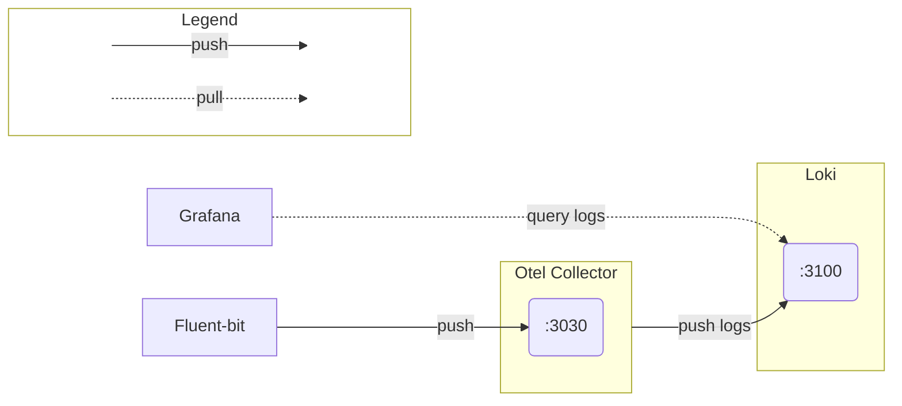

# Eureka

## Kubernetes

Для простоти в цій демонстрації я використовую `microk8s` із встановленими аддонами `dns` та `metallb`.

Сервер `microk8s` можна встановити на ОС `Ubuntu` за допомогою наступної команди.
```sh
sudo snap install microk8s --classic --channel=1.30/stable
```

Щоб встановити аддони, які використовуються в цій демонстрації, виконайте наступні команди:
```sh
microk8s enable metallb:192.168.1.201-192.168.1.254

microk8s enable dns
```


## Configuration
Файли конфігурації сервера та клієнта зберігаються у відповідних ресурсах ConfigMap і монтуються в директорію з jar-файлом.

Щоб змінити налаштування клієнта або сервера, відредагуйте відповідні ресурси ConfigMap:
- [client](helm/client/templates/properties-configmap.yaml)
- [сервер](helm/server/templates/properties-configmap.yaml)


## Installation
Kubernetes-ресурси клієнта і сервера описані в хелм чартах, які знаходяться в директорії `helm`.

Щоб встановити клієнт і сервер, необхідно виконати наступні команди:
```sh
helm dependency update ./helm/app
helm dependency build ./helm/app
helm install eureka ./helm/app
```

### Installation demo
Коротка демонстрація того, як встановлюються клієнт і сервер за допомогою `Helm`.
[](https://asciinema.org/a/L7KTCs6b8YAa8TyxPWGwdP6TE)

Окремо встановлюється [моніторинговий стек](#monitoring)

## UI
Отримати URL веб-інтерфейсів клієнта і сервера можна за допомогою наступних команд.

Для клієнта:
```sh
CLIENT_IP=$(kubectl get svc eureka-client -o jsonpath="{.status.loadBalancer.ingress[0].ip}")
echo "http://${CLIENT_IP}:8761"
```

Для сервера:
```sh
SERVER_IP=$(kubectl get svc eureka-server -o jsonpath="{.status.loadBalancer.ingress[0].ip}")
echo "http://${SERVER_IP}:8761"
```

## CI/CD
У якості CI/CD для запуску тестів, створення образів контейнерів та інших задач використовується GitHub Actions.


## Links to Docker images
Для зберігання образів контейнерів використовується сховище GitHub Container Repository.

Посилання на образи клієнта і сервера:
- [eureka-client](https://github.com/yevgen-grytsay/eureka/pkgs/container/eureka-client)
- [eureka-server](https://github.com/yevgen-grytsay/eureka/pkgs/container/eureka-server)


## Monitoring
Моніторинговий стек включає в себе такі компоненти: `Fluent-bit`, `OpenTelemetry Collector`, `Loki` та `Grafana`. Збираються 1) тільки логи 2) тільки з сервера і клієнта Eureka. З інших подів логи не збираються. Метрики і трейси не збираються.

Щоб встановити моніторинговий стек, виконайте команди:
```sh
cd ./terraform
terraform apply
```

### Схема роботи моніторингового стеку


### Проблеми
Чомусь Fluent-bit неправильно визначав ім'я поду, через що не міг отримати інформацію про нього, щоб включити цю інформацію в лог.

У логах самого Fluent-bit (`logLevel: debug`), з'являлись такі повідомлення:
```
[2024/06/10 22:12:08] [debug] [input:tail:tail.0] inode=1069058, /var/log/containers/eureka-server-d5c5776b6-dh5x2_default_eureka-server-092be7f49771b95692095c84771282b9f106bfa9f6ce03e5ebf8491dcc6d4aa2.log, events: IN_MODIFY
[2024/06/10 22:12:08] [debug] [filter:kubernetes:kubernetes.0] Send out request to API Server for pods information
[2024/06/10 22:12:08] [debug] [http_client] not using http_proxy for header
[2024/06/10 22:12:08] [debug] [http_client] server kubernetes.default.svc:443 will close connection #54
[2024/06/10 22:12:08] [debug] [filter:kubernetes:kubernetes.0] Request (ns=default, pod=s.eureka-server-d5c5776b6-dh5x2) http_do=0, HTTP Status: 404
[2024/06/10 22:12:08] [debug] [filter:kubernetes:kubernetes.0] HTTP response
{"kind":"Status","apiVersion":"v1","metadata":{},"status":"Failure","message":"pods \"s.eureka-server-d5c5776b6-dh5x2\" not found","reason":"NotFound","details":{"name":"s.eureka-server-d5c5776b6-dh5x2","kind":"pods"},"code":404}
```

Пофіксилося явним вказанням потрібного парсера, який вже включений до стандартної конфігурації Fluent-bit. Йдеться про парсер [kube-custom](https://github.com/fluent/fluent-bit/blob/master/conf/parsers.conf#L127):
```
[PARSER]
    Name    kube-custom
    Format  regex
    Regex   (?<tag>[^.]+)?\.?(?<pod_name>[a-z0-9](?:[-a-z0-9]*[a-z0-9])?(?:\.[a-z0-9]([-a-z0-9]*[a-z0-9])?)*)_(?<namespace_name>[^_]+)_(?<container_name>.+)-(?<docker_id>[a-z0-9]{64})\.log$
```

## Resources
### Spring
- [External Application Properties](https://docs.spring.io/spring-boot/reference/features/external-config.html#features.external-config.files)

- [Spring Boot with Docker](https://spring.io/guides/gs/spring-boot-docker)

- [Spring Cloud Netflix](https://cloud.spring.io/spring-cloud-netflix/reference/html/)

### Other
- [Publishing Docker images](https://docs.github.com/en/actions/publishing-packages/publishing-docker-images)

- [docker/metadata-action](https://github.com/marketplace/actions/docker-metadata-action)

- [docker/build-push-action](https://github.com/docker/build-push-action)

- [Populate a Volume with data stored in a ConfigMap](https://kubernetes.io/docs/tasks/configure-pod-container/configure-pod-configmap/#populate-a-volume-with-data-stored-in-a-configmap)